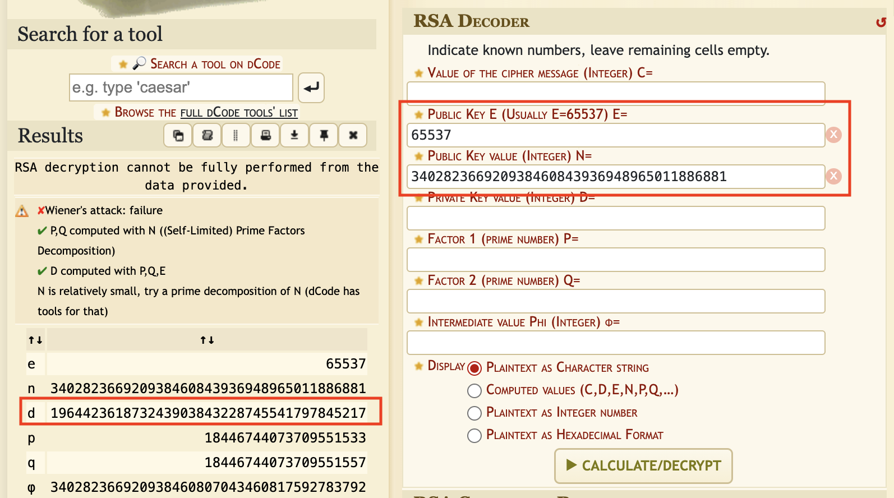

<br>

<p align="center">
    
</p>

<br>

# TryHackMe - Dark Matter (Easy)

💡 TryHackMe room : https://tryhackme.com/room/darkmatter

💻 OS : Ubuntu

## Table of contents 

- **[Setup & Tools](#setup-and-tools)**
- **[Write-up](#write-up)**

<br>

## Setup and Tools 

- Ubuntu machine
- RSA decoder
- Encryption knowledges

## Write-Up

### 1. Discover the infected machine

To begin, we're welcomed with a popup asking us to send 0.5 bitcoins to get our files decrypted 🤡


<br>

Effectively, we found to `.docx` documents on the desktop that are encrypted :


<br>

### 2. Find the key and decrypt our files

We got a quick hint in the description of the challenge, that there is interesting things in the `/tmp` folder. Let's see what's inside : 

```
cd /tmp                 (we find public_key.txt in it)

cat public_key.txt
```


<br>

Once we have the public key with the value of `n` and `e`. 

We also notice that `n` is <u>only</u> 128 bits long, proving this key is EXTREMELY insecure, the standard is 1024 or 2048 bits.

<br>

**Now, we can try to decrypt the key with dcode.fr website !**



<br>

As you can see, the website successfully achieved the task to decode the key due to low key value (only 128 bits). For your information, `d` is the private key made with `n` and `e`, check [this article](https://medium.com/@mazen.elheni/understanding-rsa-encryption-a-simple-guide-using-c-ee1873a1f54a) form *Mazen Elheni* on Medium to well understand.

### 3. Decrypting the `.docx` files