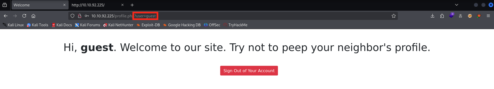
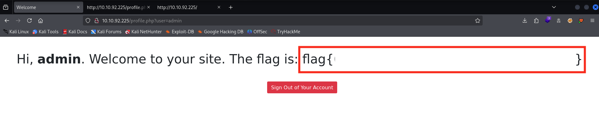

    

 

# TryHackMe - Neighbour (Very Easy)

💡 TryHackMe room : https://tryhackme.com/room/neighbour

💻 OS : Linux (Kali or not)

 

## Table of contents 

- [Setup & Tools](#setup-and-tools)
- [Write-up](#write-up)

 

## Setup and Tools 

For this **really easy** write-up, no tools are required instead of your laptop and your knowledges.

 

## Write-Up

 

### 1. Visiting the website

Firstly, we can start by visiting the website with the IP provided by the machine : **http://MACHINE_IP**

We land on a login page with a message to uwse guest account if we don't already have an account.

By chekcing the source code of this page, we discover two things :  
- To connect as a guest, we can use **guest:guest** credentials,
- the admin account is *"out of limits!!!!!"*

 

### 2. Connecting to the website

Right after connecting to the website with the credentials freshly found, we arrive on a home page welcoming us with our name, so *"guest"*, and we can note that there is a fancy parameters in the url.

 

💡 **A hint is given for those who've checked the sourcecode of the page when connected as guest :**

### 3. Accessing admin account

To finish, we can abuse the <u>IDOR</u> vulnerability on this website by modifying the url parameter *"?user="*, trying some you'll find that **"user=admin"** works and the flag appear !!

ℹ️ **more on IDOR (Insecure Direct Object Reference): [What are IDOR?](https://portswigger.net/web-security/access-control/idor)**

