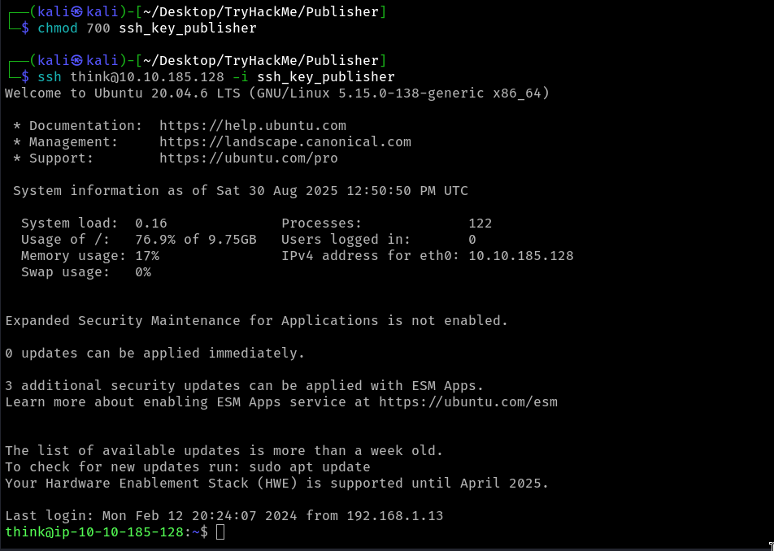

<br>

<p align="center">
    
</p>

<br>

# TryHackMe - Publisher (Easy)

💡 TryHackMe room : https://tryhackme.com/room/publisher

💻 OS : Kali Linux

## Table of contents 

- **[Setup & Tools](#setup-and-tools)**
- **[Write-up](#write-up)**
    - [1. Recon](#recon)
    - [2. Exploit](#exploit)
    - [3. PrivEsc](#privesc)

<br>

## Setup and Tools 

- nmap (port enumeration)
- ffuf (fuzzing directories)
- Linux knowledges (permissions, filesystem, shell...)
- AppArmor knowledges ([check the documentation](#privesc))

<br>

## Write-Up

**Target IP : 10.10.185.128**

**website discovered : http://10.10.185.128:80**
<br>

### 1. Recon

Firstly, we'll try to enumerate the open ports of the machine using nmap.

nmap command : `nmap -sCV -T4 -p 22,80 --min-rate 150 10.10.185.128`

**results :**
```yaml
Nmap scan report for 10.10.185.128
Host is up (0.15s latency).

PORT    STATE    SERVICE   VERSION
22/tcp open
ssh
OpenSSH 8.2p1 Ubuntu 4ubuntuo.13 (Ubuntu Linux; protocol 2.0)
ssh-hostkey:
3072 3d:32:ee: bc: 89:df:94:02:75:69:d9:ac: f6:81:55:7e (RSA)
256 85: cb:50:eb: 56:55:ae: c6: e4:b2:87:40:75:b6:4c:94 (ECDSA)
256 b5:55:54:96:8a:5b: fa: 42:5d:0c:1a:7b: cc: ff: ff:05 (ED25519)

80/tcp open
http
Apache httpd 2.4.41 ((Ubuntu))
I_http-title: Publisher's Pulse: SPIP Insights & Tips
I_http-server-header: Apache/2.4.41 (Ubuntu)
Service Info: 0S: Linux; CPE: cpe:/o:linux: linux_kernel
```

<br>

The homepage of the website found on `port 80`


<br>

With this website discovered, and a SSH port open, we can then fuzzing the website directories to find interesting informations.

ffuf command : `ffuf -w /usr/share/seclists/Discovery/Web-Content/directory-list-2.3-medium.txt -u http://10.10.185.128/FUZZ -recursion`

**results :**
```yaml
images                  [Status: 301, Size: 315, Words: 20, Lines: 10, Duration: 3080ms]
[INFO] Adding a new job to the queue: http://10.10.185.128/images/FUZZ
                        [Status: 200, Size: 8686, Words: 1334, Lines: 151, Duration: 2119ms]

spip                    [Status: 301, Size: 313, Words: 20, Lines: 10, Duration: 165ms]
[INFO] Adding a new job to the queue: http://10.10.185.128/spip/FUZZ
                        [Status: 200, Size: 8686, Words: 1334, Lines: 151, Duration: 150ms]

server-status           [Status: 403, Size: 278, Words: 20, Lines: 10, Duration: 156ms]
```


<br>

So, we find the images directory, not really interesting... but the next one is ! "SPIP"

**/spip page :**


<br>

### 2. Exploit

On the new webpage found, the CMS version of SPIP is written in source code : `spip 4.2.0`

The next step is to check if there's not a possible vulnerability and exploit for this configuration and... bingo ! 

**CVE-2023-27372** ([link to searchsploit](https://www.exploit-db.com/exploits/51536))

<br>

While searching about this CVE, I found a Github repo containing a python tool to facilitate this exploit utilisation

**[Python tools from nuts7](https://github.com/nuts7/CVE-2023-27372)**

Downloading the tool and testing it through a *test.txt* file to check the file inclusion.


<br>

**results:**


<br>
<br>

Well! the exploit is functioning, so now we could think to a more elaborate inclusion, like a webshell or reverse shell. While trying to implement a reverse shell, i did'nt got a clear so i had to test the webshell which is maybe more easy to include : 


<br>

**results:**


<br>

Ok now we're connected to the *www-data* user, we can try to enumerate interesting information, starting by the home's directories. The first and only one we found is **think**.
Listing he's home directory gives us the first user flag `user.txt`.


<br> 

The last thing to check before going forward in our challenge is the .ssh directory in **think** home directory. `.ssh` is readable for everyone and we can find the **private key** for user think ! We can simply copy/paste the content of the id_rsa key on our attacker machine, and connect to the account without any password in ssh. 

⚠️ Remember to always give the good permissions to the key on your machine with `chmod 700 [key_file]` and connect to ssh with `-i` arg to specify the key path.



<br>

### 3. PrivEsc

Right, we just found an access to **think** user through `ssh`, we now need to find a way to root account by abusing a misconfiguration or new vulnerabilty. 
As always, I try to find a binary to with bad SUID permission with : `find / -perm -u=s -type f 2>/dev/null`


*`run_container` looks like it's not a pre-built binary from linux, maybe a door to root ?*

<br>

Now, try check permissions and execute the binary found :


*we can run the script, but don't write it*

<br>


*there's an error on script, line 16*

<br>
<br>

So, let's check for this error in the `/opt/` directory, but unfortunately, we cannot read the directory... weird.


<br>

``` 
💡 In this situation, I was a bit blocked and need to use hint from TryHackMe, that give me the solution about "AppArmor" securization.
```

<br>

more on AppArmor : [google cloud](https://cloud.google.com/container-optimized-os/docs/how-to/secure-apparmor?hl=fr#:~:text=AppArmor%20est%20un%20module%20de,son%20propre%20profil%20de%20s%C3%A9curit%C3%A9.)

With some research, I found that AppArmor is traditionnaly located in `/etc/apparmor.d/*`and some rules files are in this directory. The one that'll interesting us is `usr.sbin.ash`


<br> 

So, we understand that users with `ash` shell will not acces some directories and files, or have limited access and permissions. To check if *think* have ash shell, we use `echo $SHELL` and... **obviously we have** ash shell.

Let's try to bypass AppArmor rules !


<br> 

We create a new file `pwn.sh` in /var/tmp/ and write in it a simple command to spawn a bash shell in our current shell, then we can launch it directly in /var/tmp and try to execute commands we cannot do before : `ls -l /opt/`... BINGO, the command execute perfectly.

With our new permissions, we can modify the binary `run_container` and simply add a line to spawn a bash shell in the current session. Because of file permissions, the binary is always executed with root permissions, so the shell we'll be a **root** shell.


<br> 

That's all, we can navigate easily to the root's home directory and read the flag file to end this challenge.


<br> 