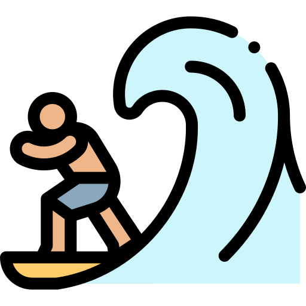
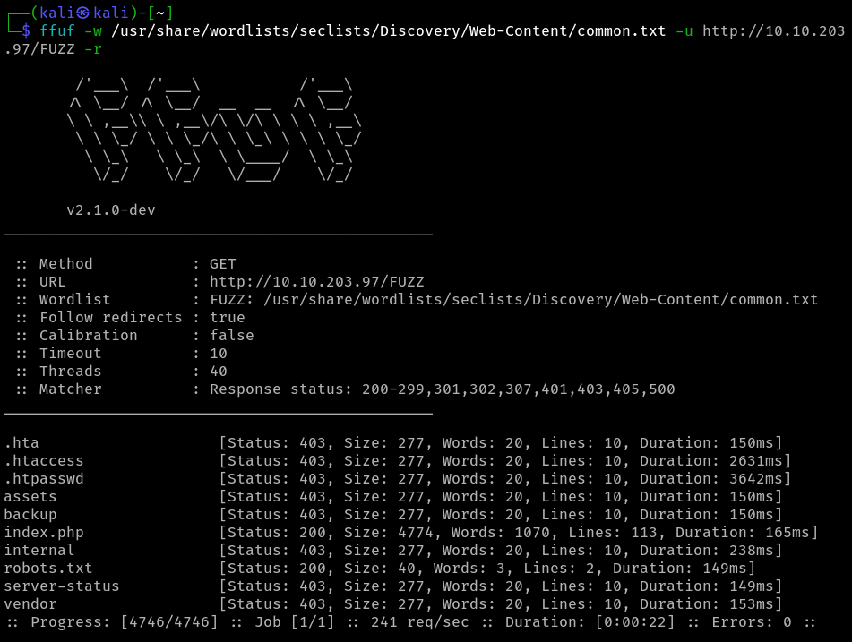
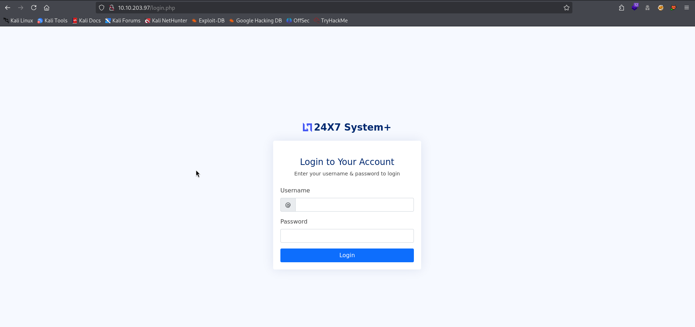
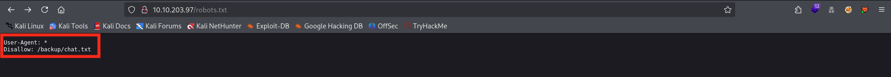
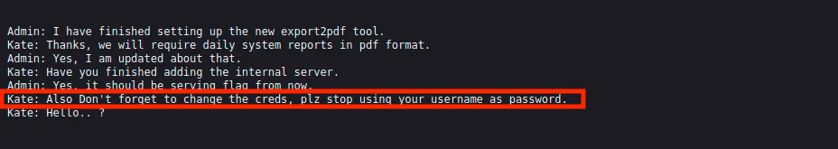
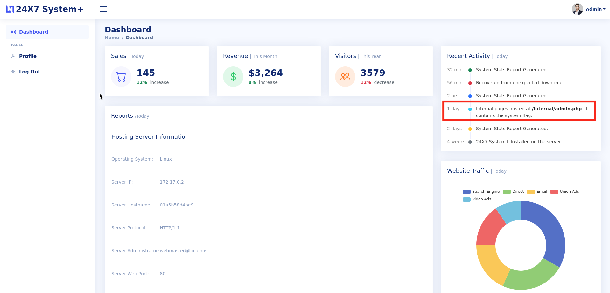

 

    

 

# TryHackMe - Surfer (Easy)

💡 TryHackMe room : https://tryhackme.com/room/surfer

💻 OS : Kali Linux

## Table of contents 

- **[Setup & Tools](#setup-and-tools)**
- **[Write-up](#write-up)**
 

## Setup and Tools 

- nmap (port enumeration)
- ffuf (fuzzing directories)
- Burp Suite (web pentest)
- Web knowledges (protocols, how it works...)
 

## Write-Up

**Target IP : 10.10.203.97**

**website discovered : http://10.10.203.97:80**
 
 

To begin, we've an IP address so we start by enumerating the directories of this website with `ffuf`. 
- Using the wordlist `common.txt` located in seclist directory on Kali,
- Providing the IP with `-u` flag,
- Recursively with `-r` flag.

We found (maybe) some interresting webpages : 
- backup
- internal
- robots.txt
- vendor...

 

The `index.php` redirect to a login page :

 

And weirdly, when we visit the `robots.txt` we can read a specific line that disallow `backup/chat.txt`. Unusual no ?

 

And when visiting this newly discovered webpage, we're facing a chat between the admin and "Kate", talking about some **really instructive informations** : 

 

MMMH... interresing. We can now try to authenticate through to login page we found previously and... **bingo** ! We're logged on a dashboard as admin.

