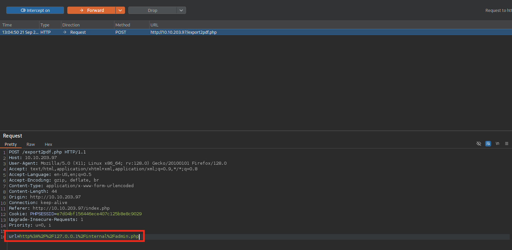
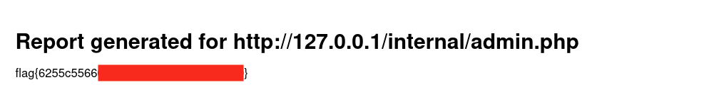

 

    

 

# TryHackMe - Surfer (Easy)

💡 TryHackMe room : https://tryhackme.com/room/surfer

💻 OS : Kali Linux

## Table of contents 

- **[Setup & Tools](#setup-and-tools)**
- **[Write-up](#write-up)**
 

## Setup and Tools 

- nmap (port enumeration)
- ffuf (fuzzing directories)
- Burp Suite (web pentest)
- Web knowledges (protocols, how it works...)
 

## Write-Up

**Target IP : 10.10.203.97**

**website discovered : http://10.10.203.97:80**
 
 

To begin, we've an IP address so we start by enumerating the directories of this website with `ffuf`. 
- Using the wordlist `common.txt` located in seclist directory on Kali,
- Providing the IP with `-u` flag,
- Recursively with `-r` flag.

We found (maybe) some interresting webpages : 
- backup
- internal
- robots.txt
- vendor...

 

The `index.php` redirect to a login page :

 

And weirdly, when we visit the `robots.txt` we can read a specific line that disallow `backup/chat.txt`. Unusual no ?

 

And when visiting this newly discovered webpage, we're facing a chat between the admin and "Kate", talking about some **really instructive informations** : 

 

MMMH... interresing. We can now try to authenticate through to login page we found previously and... **bingo** ! We're logged on a dashboard as admin.

 

While seeing around the website dashboard logged in as admin, we can figure out that one of the only interresing things we can do is generation a `.pdf` report.
Also, we notice on the right that an internal page is hosted and contain the **flag** !

This is an example on report we can generate through the website : 

 

As we can see, the report is generated from the **local** server ! (proved by `http://127.0.0.1`)

Maybe we can find a way to exploit this... **Using Burp Suite** [(see Burp Suite documentation)](https://portswigger.net/burp/documentation)

With Burp Suite, we can intercept an HTTP request, modify it and transfer it back to our browser, with the modificated request body or parameters.

Note that the body of the request contain an url parameter which is the url of the page that is exported in the PDF report. So we can try to modify it to get the `/internal/admin.php`. *(think to encode the url, so "`/`" begins "`%2F`")*

**and... BOOM** 💥 We just found our flag in the reported page `/internal/admin.php`! 

